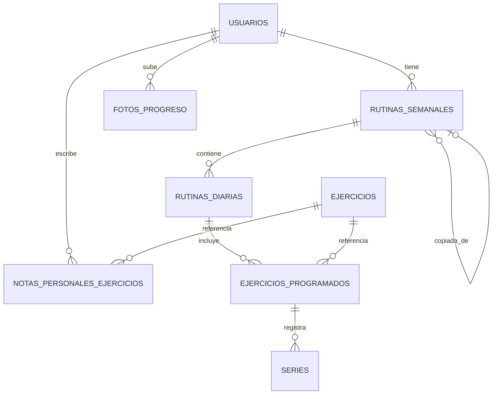

# PressFit - Arquitectura y Diseño de Sistema (Actualizado Feb 2026)

> **Última revisión**: Feb 2026. Esquema verificado directamente desde los servicios de la app (`RoutineService`, `WorkoutService`, `UserService`, `ProgressService`, `ExerciseService`).

---

## 1. Descripción General

**PressFit** es una app móvil de seguimiento de rutinas de entrenamiento y progreso físico (React Native + Supabase).

### Características Principales

- **Gestión de Rutinas:** Planificación semanal con ejercicios, series, repeticiones y pesos.
- **Biblioteca de Ejercicios:** Catálogo con descripción, músculos trabajados y multimedia.
- **Registro de Entrenamientos:** Sesiones diarias con datos de cada serie completada.
- **Progreso Histórico:** Visualización diaria, semanal, mensual y por ejercicio.
- **Galería de Progreso:** Fotos bodyprogress con almacenamiento en Supabase Storage.

---

## 2. Stack Tecnológico

| Componente | Tecnología |
|---|---|
| Frontend | React Native (Expo) |
| Backend | Supabase (Auth, DB, Storage) |
| Base de Datos | PostgreSQL (Supabase) |
| Autenticación | Supabase Auth (Google OAuth / Email) |
| Storage | Supabase Storage (fotos-progreso, fotos-perfil, multimedia-ejercicios) |

---

## 3. Modelo de Datos Real (Esquema Actual)

### Diagrama de Relaciones



---

### Tabla: `usuarios`
Perfil del usuario extendido. Se sincroniza automáticamente con `auth.users` vía trigger.

| Columna | Tipo | Notas |
|---|---|---|
| `id` | UUID PK | Referencia a `auth.users(id)` |
| `email` | TEXT UNIQUE | Email validado |
| `nombre` | TEXT | Nombre completo |
| `apellidos` | TEXT | Apellidos |
| `peso` | NUMERIC(5,2) | Kg (ej: 85.50) |
| `altura` | NUMERIC(3,2) | Metros (ej: 1.80). La app convierte de/a cm. |
| `imc` | NUMERIC(4,2) | Índice de Masa Corporal |
| `grasa_corporal` | NUMERIC(4,1) | 0-100 |
| `url_foto` | TEXT | URL foto de perfil (Supabase Storage bucket `fotos-perfil`) |
| `created_at` | TIMESTAMPTZ | |
| `updated_at` | TIMESTAMPTZ | Auto-actualizado por trigger |

**RLS:** Usuario solo accede a su propio registro (`auth.uid() = id`).

---

### Tabla: `ejercicios`
Catálogo maestro de ejercicios. Solo lectura para usuarios normales.

| Columna | Tipo | Notas |
|---|---|---|
| `id` | UUID PK | |
| `titulo` | TEXT | Nombre del ejercicio |
| `descripcion` | TEXT | Descripción detallada |
| `grupo_muscular` | TEXT | Grupo muscular principal |
| `musculos_primarios` | JSONB | Array de músculos primarios |
| `musculos_secundarios` | JSONB | Array de músculos secundarios |
| `url_video` | TEXT | URL vídeo demostrativo |
| `url_foto` | TEXT | URL imagen |
| `dificultad` | TEXT | `beginner` / `intermediate` / `advanced` |
| `categoria` | TEXT | press, pull, squat, etc. |
| `created_at` | TIMESTAMPTZ | |
| `updated_at` | TIMESTAMPTZ | |

**RLS:** Lectura pública. Escritura solo admin.

---

### Tabla: `rutinas_semanales`
Contenedor principal de rutina. Puede ser plantilla reutilizable o instancia activa.

| Columna | Tipo | Notas |
|---|---|---|
| `id` | UUID PK | |
| `usuario_id` | UUID FK → `usuarios` | |
| `nombre` | TEXT | Nombre de la rutina |
| `objetivo` | TEXT | Objetivo de la semana |
| `es_plantilla` | BOOLEAN | `true` = modelo a copiar |
| `copiada_de_id` | UUID FK → `rutinas_semanales` | Ref. recursiva a la plantilla origen |
| `fecha_inicio_semana` | DATE | Lunes de la semana activa (NULL si plantilla) |
| `activa` | BOOLEAN | Solo una activa por usuario |
| `created_at` | TIMESTAMPTZ | |
| `updated_at` | TIMESTAMPTZ | |

**Tipos de rutina:**

| Tipo | `es_plantilla` | `copiada_de_id` | `fecha_inicio_semana` |
|---|---|---|---|
| Plantilla | `true` | `NULL` | `NULL` |
| Rutina activa | `false` | `NULL` | Lunes actual |
| Creada desde plantilla | `false` | ID plantilla | Lunes actual |

---

### Tabla: `rutinas_diarias`
Representa un día de entrenamiento. Puede ser plantilla (sin fecha) o instancia real.

| Columna | Tipo | Notas |
|---|---|---|
| `id` | UUID PK | |
| `rutina_semanal_id` | UUID FK → `rutinas_semanales` | |
| `nombre_dia` | TEXT | 'Lunes', 'Martes'... |
| `fecha_dia` | DATE | NULL si es plantilla |
| `hora_inicio` | TIMESTAMPTZ | Inicio de sesión |
| `hora_fin` | TIMESTAMPTZ | Fin de sesión |
| `completada` | BOOLEAN | `true` cuando finalizada |
| `descripcion` | TEXT | Descripción del día de entreno (ej. "Día de Piernas") |
| `created_at` | TIMESTAMPTZ | |
| `updated_at` | TIMESTAMPTZ | |

**Estados por combinación de campos:**

| `fecha_dia` | `hora_inicio` | `hora_fin` | `completada` | Estado |
|---|---|---|---|---|
| NULL | NULL | NULL | false | Plantilla |
| fecha | timestamp | NULL | false | En Progreso |
| fecha | timestamp | timestamp | true | Completado |

---

### Tabla: `ejercicios_programados`
Tabla pivote entre `rutinas_diarias` y `ejercicios`. Instancia un ejercicio dentro de un día.

| Columna | Tipo | Notas |
|---|---|---|
| `id` | UUID PK | |
| `rutina_diaria_id` | UUID FK → `rutinas_diarias` | |
| `ejercicio_id` | UUID FK → `ejercicios` | |
| `orden_ejecucion` | INTEGER | Orden dentro del día |
| `notas_sesion` | TEXT | Notas específicas del día |
| `created_at` | TIMESTAMPTZ | |
| `updated_at` | TIMESTAMPTZ | |

---

### Tabla: `series`
Unidad mínima de datos. Registra cada serie de un ejercicio en un entrenamiento.

| Columna | Tipo | Notas |
|---|---|---|
| `id` | UUID PK | |
| `ejercicio_programado_id` | UUID FK → `ejercicios_programados` | |
| `numero_serie` | INTEGER | 1, 2, 3... |
| `repeticiones` | INTEGER | NULL = placeholder (el usuario debe rellenar) |
| `peso_utilizado` | NUMERIC(6,2) | Kg |
| `rpe` | INTEGER | 1-10 (esfuerzo percibido) |
| `descanso_segundos` | INTEGER | Tiempo de descanso tras la serie (en segundos) |
| `created_at` | TIMESTAMPTZ | |
| `updated_at` | TIMESTAMPTZ | |

---

### Tabla: `historial_peso`
Historial temporal del peso corporal del usuario. Permite graficar evolución.

| Columna | Tipo | Notas |
|---|---|---|
| `id` | UUID PK | |
| `usuario_id` | UUID FK → `usuarios` | |
| `peso` | NUMERIC(5,2) | Kg |
| `fecha_registro` | DATE | Fecha de la medición |
| `created_at` | TIMESTAMPTZ | |

**RLS:** Usuario solo accede a su propio historial (`auth.uid() = usuario_id`).
**Índice:** `(usuario_id, fecha_registro DESC)` para consultas eficientes.

---

### Tabla: `fotos_progreso`
Galería de progreso físico del usuario.

| Columna | Tipo | Notas |
|---|---|---|
| `id` | UUID PK | |
| `usuario_id` | UUID FK → `usuarios` | |
| `url_foto` | TEXT | Ruta en bucket Storage `fotos-progreso` |
| `comentario` | TEXT | Comentario opcional |
| `created_at` | TIMESTAMPTZ | |
| `updated_at` | TIMESTAMPTZ | |

---

### Tabla: `notas_personales_ejercicios`
Notas personales de un usuario sobre un ejercicio específico.

| Columna | Tipo | Notas |
|---|---|---|
| `id` | UUID PK | |
| `usuario_id` | UUID FK → `usuarios` | |
| `ejercicio_id` | UUID FK → `ejercicios` | |
| `contenido_nota` | TEXT | |
| `created_at` | TIMESTAMPTZ | |
| `updated_at` | TIMESTAMPTZ | |

**Constraint:** `UNIQUE(usuario_id, ejercicio_id)` → una nota por ejercicio por usuario.

---

## 4. Storage (Buckets)

| Bucket | Visibilidad | Uso |
|---|---|---|
| `fotos-progreso` | Privado (signed URLs) | Fotos de progreso físico |
| `fotos-perfil` | Público | Foto de perfil del usuario |
| `multimedia-ejercicios` | Público | Vídeos e imágenes del catálogo |

---

## 5. Flujos Principales

Ver [WORKFLOW_FLOWS.md](file:///c:/PressFit/PressFitNew/PressFit_Expo/Documentacion/WORKFLOW_FLOWS.md) para los diagramas de secuencia detallados.

### Flujo Raíz de Datos

```
USUARIO → RUTINAS_SEMANALES → RUTINAS_DIARIAS → EJERCICIOS_PROGRAMADOS → SERIES
                                                       ↑
                                                  EJERCICIOS (catálogo)
```

### Flujo de Entrenamiento
1. **Plantilla** → `es_plantilla=true`, días sin fecha ni hora
2. **Iniciar día** → Se copia la plantilla: nueva `rutina_diaria` con `fecha_dia=hoy`, `hora_inicio=ahora`
3. **Progresión** → Se buscan series del mismo día la semana pasada → pesos copiados como placeholder
4. **Finalizar** → `completada=true`, `hora_fin=ahora`

---

## 6. Seguridad (RLS)

| Tabla | Política |
|---|---|
| `usuarios` | Solo el propio usuario (`auth.uid() = id`) |
| `ejercicios` | Lectura pública |
| `rutinas_semanales` | Solo propietario (`auth.uid() = usuario_id`) |
| `rutinas_diarias` | Heredada vía join con `rutinas_semanales` |
| `ejercicios_programados` | Heredada vía join con `rutinas_diarias` → `rutinas_semanales` |
| `series` | Heredada vía join con `ejercicios_programados` → ... → `rutinas_semanales` |
| `fotos_progreso` | Solo propietario (`auth.uid() = usuario_id`) |
| `notas_personales_ejercicios` | Solo propietario (`auth.uid() = usuario_id`) |

---

## 7. Tablas Obsoletas (Esquema Antiguo)

Las siguientes tablas aparecían en la documentación anterior pero **ya NO existen** en la base de datos real:

| Tabla antigua | Reemplazada por |
|---|---|
| `profiles` | `usuarios` |
| `user_metrics` | Columnas `peso`, `altura`, `imc`, `grasa_corporal` integradas en `usuarios` |
| `routines` | `rutinas_semanales` |
| `routine_days` | `rutinas_diarias` |
| `routine_exercises` | `ejercicios_programados` |
| `workouts` | `rutinas_diarias` (con `fecha_dia` no NULL) |
| `workout_sets` | `series` |
| `progress_photos` | `fotos_progreso` |
| `personal_records` | *(No migrado — pendiente de implementación)* |