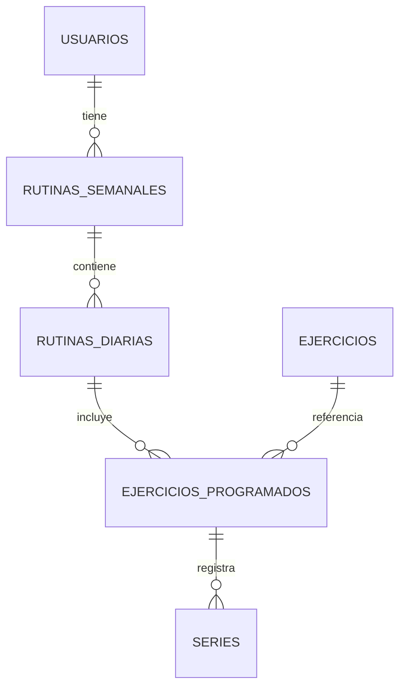
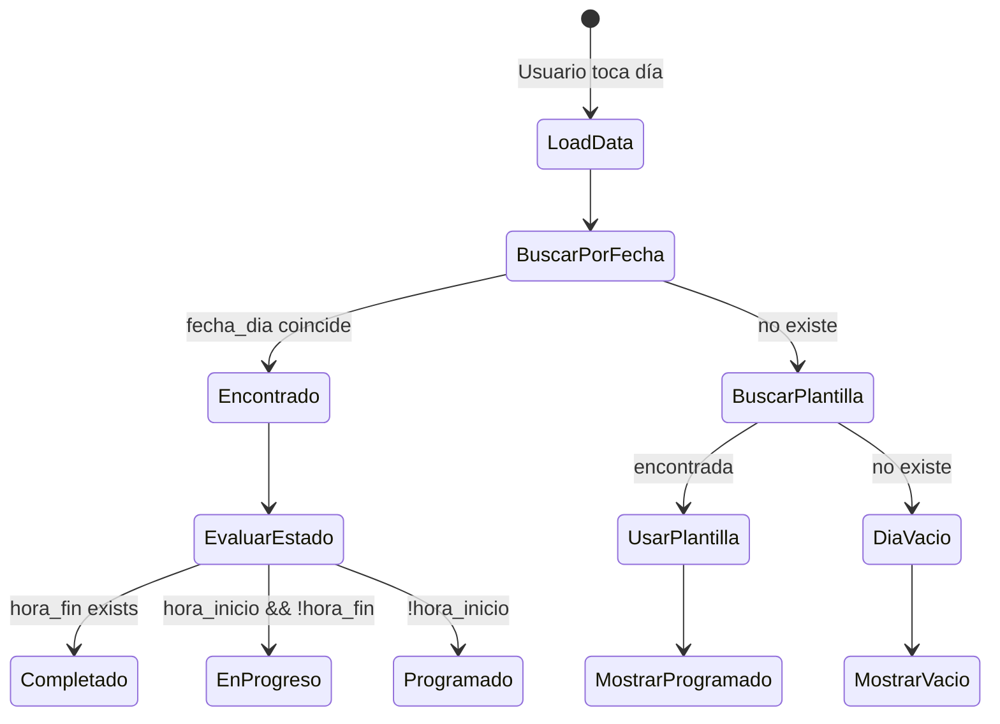
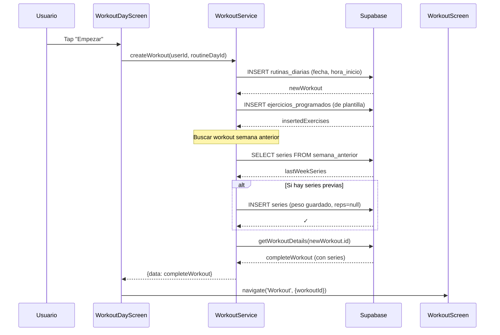
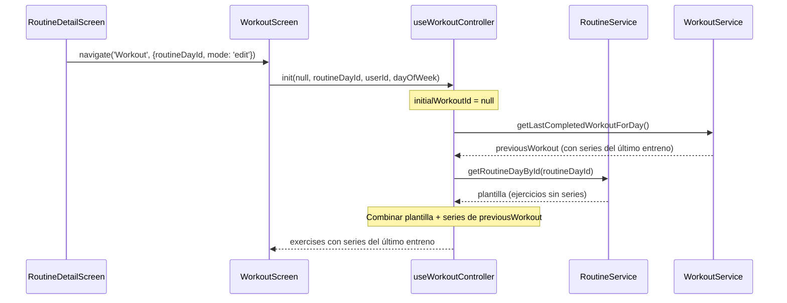
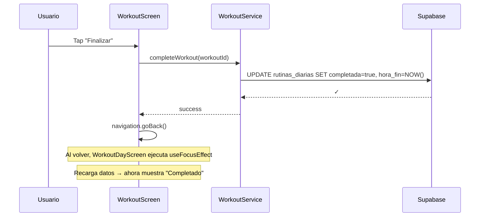
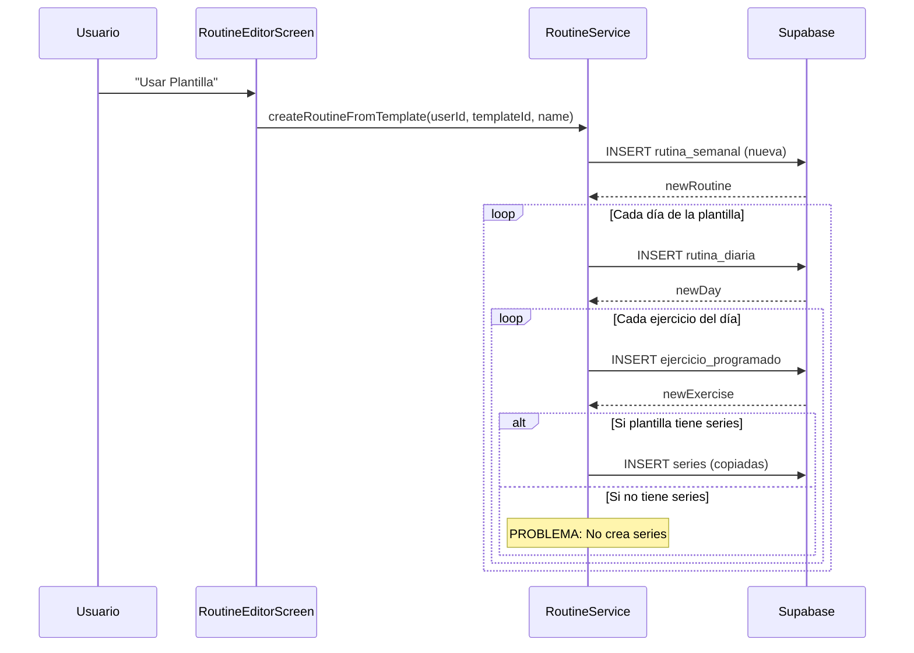
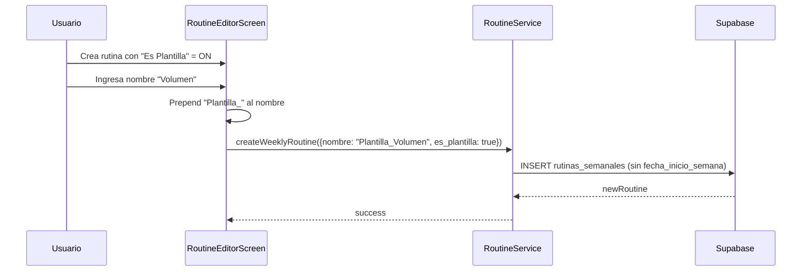
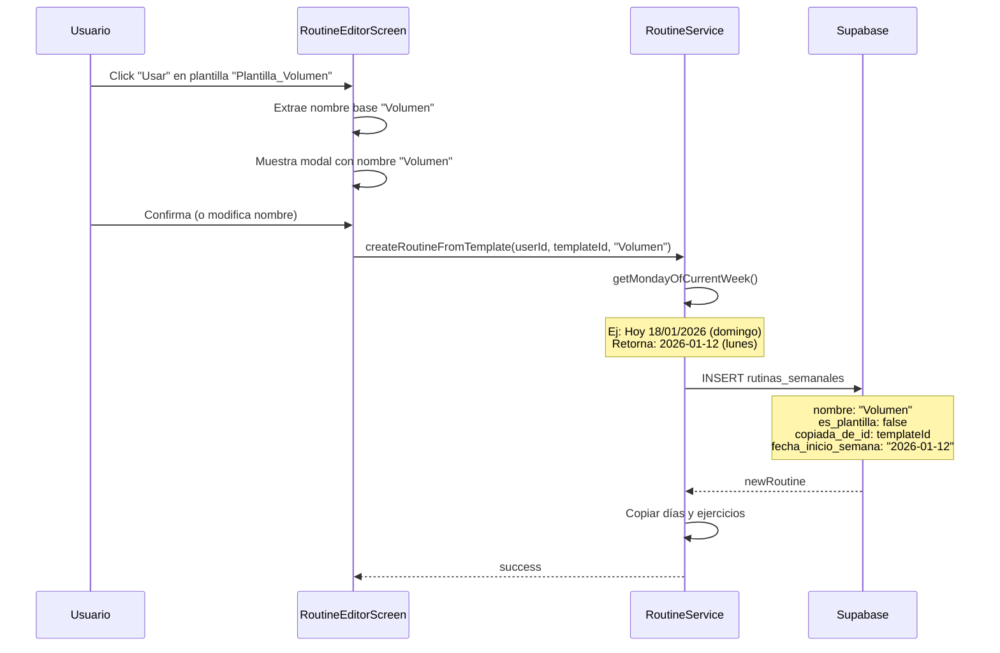
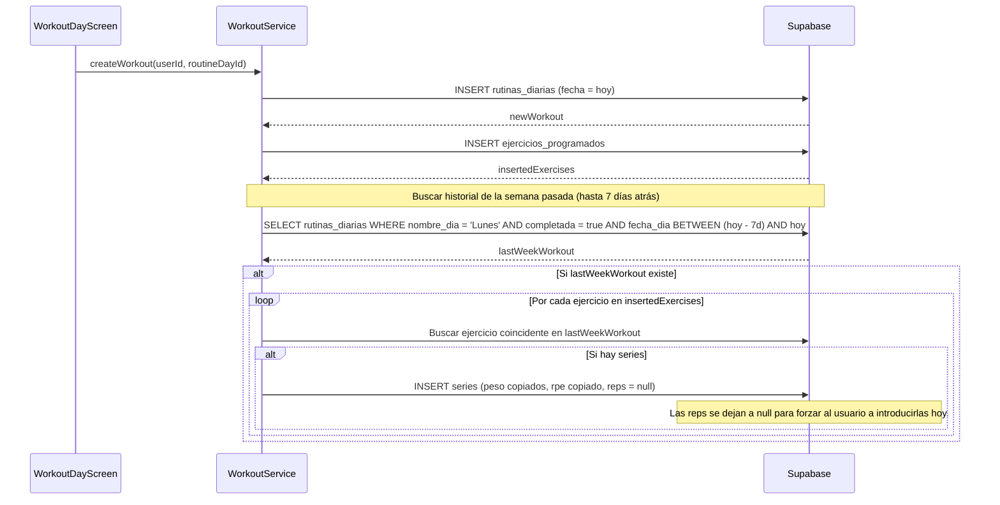
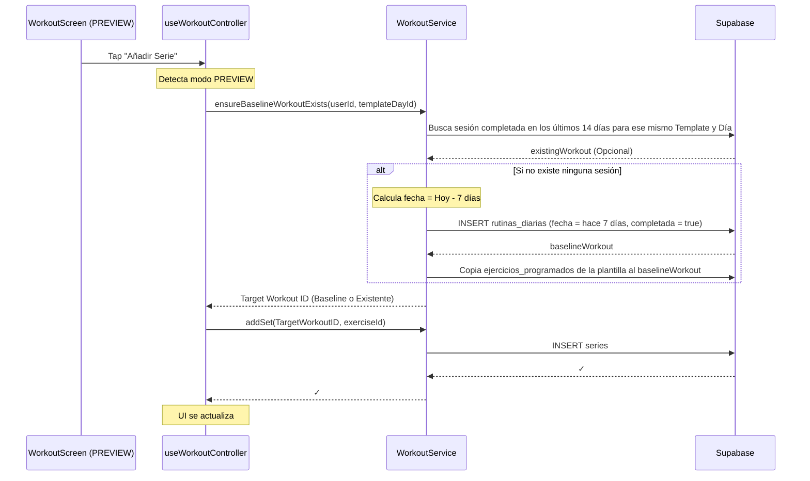

# Flujos de Trabajo - PressFit Expo

## Visión General

Este documento define los flujos de trabajo e información de la app para garantizar que cada interacción del usuario funcione correctamente de inicio a fin.

---

## Modelo de Datos Principal


```mermaid
erDiagram
    USUARIOS ||--o{ RUTINAS_SEMANALES : tiene
    RUTINAS_SEMANALES ||--o{ RUTINAS_DIARIAS : contiene
    RUTINAS_DIARIAS ||--o{ EJERCICIOS_PROGRAMADOS : incluye
    EJERCICIOS_PROGRAMADOS ||--o{ SERIES : registra
    EJERCICIOS ||--o{ EJERCICIOS_PROGRAMADOS : referencia
```

### Tipos de `rutinas_diarias`

| Tipo | `fecha_dia` | `hora_inicio` | `hora_fin` | `completada` |
|------|-------------|---------------|------------|--------------|
| **Plantilla** | `NULL` | `NULL` | `NULL` | `false` |
| **En Progreso** | fecha | timestamp | `NULL` | `false` |
| **Completado** | fecha | timestamp | timestamp | `true` |

---

## Flujo 1: Ver Día en Calendario (WorkoutDayScreen)

### Estados Posibles


```mermaid
stateDiagram-v2
    [*] --> LoadData: Usuario toca día
    LoadData --> BuscarPorFecha
    BuscarPorFecha --> Encontrado: fecha_dia coincide
    BuscarPorFecha --> BuscarPlantilla: no existe
    BuscarPlantilla --> UsarPlantilla: encontrada
    BuscarPlantilla --> DiaVacio: no existe
    
    Encontrado --> EvaluarEstado
    UsarPlantilla --> MostrarProgramado
    DiaVacio --> MostrarVacio
    
    EvaluarEstado --> Completado: hora_fin exists
    EvaluarEstado --> EnProgreso: hora_inicio && !hora_fin
    EvaluarEstado --> Programado: !hora_inicio
```

### Reglas de Visualización

| Condición | Estado | Botón | Duración |
|-----------|--------|-------|----------|
| `hora_fin != null` | ✅ Completado | Ninguno | `(hora_fin - hora_inicio) / 60` |
| `hora_inicio && !hora_fin` | ⏳ En Progreso | "Continuar" | - |
| `!hora_inicio && isToday` | 📋 Programado | "Empezar" | - |
| `!hora_inicio && isPast` | ❌ Sin Hacer | Ninguno | - |
| `isFuture` | 🔜 Futuro | Deshabilitado | - |

### Cálculo de Duración

```typescript
// Solo necesita hora_inicio y hora_fin (NO requiere completada)
if (targetDay.hora_inicio && targetDay.hora_fin) {
    duration = calcDuration();
}
```

---

## Flujo 2: Empezar Entrenamiento

### Secuencia


```mermaid
sequenceDiagram
    participant U as Usuario
    participant WD as WorkoutDayScreen
    participant WS as WorkoutService
    participant DB as Supabase
    participant W as WorkoutScreen

    U->>WD: Tap "Empezar"
    WD->>WS: createWorkout(userId, routineDayId)
    WS->>DB: INSERT rutinas_diarias (fecha, hora_inicio)
    DB-->>WS: newWorkout
    WS->>DB: INSERT ejercicios_programados (de plantilla)
    DB-->>WS: insertedExercises
    
    Note over WS: Buscar workout semana anterior
    WS->>DB: SELECT series FROM semana_anterior
    DB-->>WS: lastWeekSeries
    
    alt Si hay series previas
        WS->>DB: INSERT series (peso guardado, reps=null)
        DB-->>WS: ✓
    end
    
    WS->>DB: getWorkoutDetails(newWorkout.id)
    DB-->>WS: completeWorkout (con series)
    WS-->>WD: {data: completeWorkout}
    
    WD->>W: navigate('Workout', {workoutId})
```

---

## Flujo 3: WorkoutScreen - Cargar Datos

### Datos Requeridos por Ejercicio

```typescript
interface ExerciseDisplay {
    id: string;                    // ejercicio_programado.id
    ejercicio_id: string;          // ejercicio.id
    ejercicio: {
        titulo: string;
        grupo_muscular: string;
    };
    series: Array<{
        id: string;
        numero_serie: number;
        peso_utilizado: number;    // 0 si no hay dato
        repeticiones: number;      // 0 si no hay dato
        rpe?: number;
    }>;
}
```

### Regla de Series

- Si hay series copiadas de semana anterior → mostrar con valores precargados
- Si no hay series → usuario debe añadir manualmente
- Valores `peso_utilizado = 0` y `repeticiones = 0` deben mostrarse como placeholders editables

## Flujo 5: Editar Rutina (Ver Series del Último Entreno)

### Navegación

```
Calendario → FAB Editar → RoutineEditorScreen (lista rutinas)
    → Editar rutina → RoutineDetailScreen (días con ejercicios)
    → Pinchar día → WorkoutScreen (mode: 'edit')
```

### Flujo de Datos


```mermaid
sequenceDiagram
    participant RD as RoutineDetailScreen
    participant W as WorkoutScreen
    participant WC as useWorkoutController
    participant RS as RoutineService
    participant WS as WorkoutService

    RD->>W: navigate('Workout', {routineDayId, mode: 'edit'})
    W->>WC: init(null, routineDayId, userId, dayOfWeek)
    
    Note over WC: initialWorkoutId = null
    WC->>WS: getLastCompletedWorkoutForDay()
    WS-->>WC: previousWorkout (con series del último entreno)
    
    WC->>RS: getRoutineDayById(routineDayId)
    RS-->>WC: plantilla (ejercicios sin series)
    
    Note over WC: Combinar plantilla + series de previousWorkout
    WC-->>W: exercises con series del último entreno
```

### Regla

- En modo `edit` sin `workoutId`:
  - Cargar ejercicios de la plantilla
  - Poblar series desde `previousWorkout` (último entreno del mismo día)
  - Mostrar kg y reps como valores editables

---

## Flujo 4: Finalizar Entrenamiento


```mermaid
sequenceDiagram
    participant U as Usuario
    participant W as WorkoutScreen
    participant WS as WorkoutService
    participant DB as Supabase

    U->>W: Tap "Finalizar"
    W->>WS: completeWorkout(workoutId)
    WS->>DB: UPDATE rutinas_diarias SET completada=true, hora_fin=NOW()
    DB-->>WS: ✓
    WS-->>W: success
    W->>W: navigation.goBack()
    
    Note over W: Al volver, WorkoutDayScreen ejecuta useFocusEffect
    Note over W: Recarga datos → ahora muestra "Completado"
```

---

## Flujo 6: Editar Plantilla - Añadir Series

### Navegación

```
Calendario → Editar → RoutineEditor → Plantilla → Editar
    → RoutineDetail → Día → WorkoutScreen (mode: 'edit')
```

### Requisito

Las series añadidas en modo edit DEBEN guardarse en BD para que:
1. La plantilla contenga el número correcto de series
2. Al crear rutina desde plantilla, se copien esas series

### Estado Actual (BUG)

`useWorkoutController.addSets` bloquea si `mode !== ACTIVE/PREVIEW`.

### Fix Requerido

Permitir edición si `navMode === 'edit'`.

---

## Flujo 7: Crear Rutina desde Plantilla

### Secuencia


```mermaid
sequenceDiagram
    participant U as Usuario
    participant RE as RoutineEditorScreen
    participant RS as RoutineService
    participant DB as Supabase

    U->>RE: "Usar Plantilla"
    RE->>RS: createRoutineFromTemplate(userId, templateId, name)
    
    RS->>DB: INSERT rutina_semanal (nueva)
    DB-->>RS: newRoutine
    
    loop Cada día de la plantilla
        RS->>DB: INSERT rutina_diaria
        DB-->>RS: newDay
        
        loop Cada ejercicio del día
            RS->>DB: INSERT ejercicio_programado
            DB-->>RS: newExercise
            
            alt Si plantilla tiene series
                RS->>DB: INSERT series (copiadas)
            else Si no tiene series
                Note over RS: PROBLEMA: No crea series
            end
        end
    end
```

### Fix Requerido

Si ejercicio no tiene series en plantilla, crear 3 series vacías por defecto.

---

## Checklist de Validación

### WorkoutDayScreen

- [x] Carga datos por `fecha_dia` primero, luego plantilla
- [x] Calcula duración si `hora_inicio` Y `hora_fin` existen (sin requerir `completada`)
- [x] Muestra estado correcto basado en combinación de campos
- [x] `useFocusEffect` recarga datos al volver

### WorkoutService.createWorkout

- [x] Crea `rutina_diaria` con fecha y hora_inicio
- [x] Copia `ejercicios_programados` de plantilla
- [x] Busca workout de semana anterior del mismo día
- [x] Copia series si existen
- [x] Retorna datos completos con `getWorkoutDetails`

### WorkoutScreen

- [x] Carga datos frescos de BD al montar
- [x] Muestra series copiadas con valores precargados
- [x] Permite editar/agregar series
- [x] Al finalizar, actualiza BD correctamente

---

## Flujo 8: Creación y Gestión de Rutinas Semanales

### Tipos de Rutinas

| Tipo | `es_plantilla` | `copiada_de_id` | `fecha_inicio_semana` | Nombre |
|------|----------------|-----------------|----------------------|--------|
| **Plantilla** | `true` | `NULL` | `NULL` | `Plantilla_<nombre>` |
| **Rutina Normal** | `false` | `NULL` | Lunes de semana actual | `<nombre>` |
| **Rutina desde Plantilla** | `false` | ID de plantilla | Lunes de semana actual | `<nombre sin prefijo>` |

### Crear Plantilla Nueva


```mermaid
sequenceDiagram
    participant U as Usuario
    participant RE as RoutineEditorScreen
    participant RS as RoutineService
    participant DB as Supabase

    U->>RE: Crea rutina con "Es Plantilla" = ON
    U->>RE: Ingresa nombre "Volumen"
    RE->>RE: Prepend "Plantilla_" al nombre
    RE->>RS: createWeeklyRoutine({nombre: "Plantilla_Volumen", es_plantilla: true})
    RS->>DB: INSERT rutinas_semanales (sin fecha_inicio_semana)
    DB-->>RS: newRoutine
    RS-->>RE: success
```

### Regla de Nomenclatura de Plantillas

- **Al crear**: Usuario ingresa `"Volumen"` → Se guarda como `"Plantilla_Volumen"`
- **Al mostrar**: Se muestra el nombre completo `"Plantilla_Volumen"`
- **Al usar**: Se extrae `"Volumen"` como nombre por defecto para la nueva rutina

### Crear Rutina desde Plantilla


```mermaid
sequenceDiagram
    participant U as Usuario
    participant RE as RoutineEditorScreen
    participant RS as RoutineService
    participant DB as Supabase

    U->>RE: Click "Usar" en plantilla "Plantilla_Volumen"
    RE->>RE: Extrae nombre base "Volumen"
    RE->>RE: Muestra modal con nombre "Volumen"
    U->>RE: Confirma (o modifica nombre)
    RE->>RS: createRoutineFromTemplate(userId, templateId, "Volumen")
    
    RS->>RS: getMondayOfCurrentWeek()
    Note over RS: Ej: Hoy 18/01/2026 (domingo)<br/>Retorna: 2026-01-12 (lunes)
    
    RS->>DB: INSERT rutinas_semanales
    Note over DB: nombre: "Volumen"<br/>es_plantilla: false<br/>copiada_de_id: templateId<br/>fecha_inicio_semana: "2026-01-12"
    
    DB-->>RS: newRoutine
    RS->>RS: Copiar días y ejercicios
    RS-->>RE: success
```

### Cálculo de `fecha_inicio_semana`

```typescript
// getMondayOfCurrentWeek()
// Si hoy es domingo, retorna el lunes de ESTA semana (no la siguiente)
const day = now.getDay(); // 0 = Domingo
const daysToSubtract = day === 0 ? 6 : day - 1;
// Ejemplo: Domingo 18/01 → retrocede 6 días → Lunes 12/01
```

| Día Actual | `getDay()` | `daysToSubtract` | Lunes Calculado |
|------------|------------|------------------|-----------------|
| Lunes | 1 | 0 | Mismo día |
| Martes | 2 | 1 | Ayer |
| Miércoles | 3 | 2 | 2 días atrás |
| Jueves | 4 | 3 | 3 días atrás |
| Viernes | 5 | 4 | 4 días atrás |
| Sábado | 6 | 5 | 5 días atrás |
| Domingo | 0 | 6 | 6 días atrás |

### Campos de `rutinas_semanales`

| Campo | Plantilla | Rutina Normal | Rutina desde Plantilla |
|-------|-----------|---------------|------------------------|
| `nombre` | `Plantilla_<x>` | `<nombre>` | `<nombre sin prefijo>` |
| `es_plantilla` | `true` | `false` | `false` |
| `copiada_de_id` | `NULL` | `NULL` | ID de la plantilla origen |
| `fecha_inicio_semana` | `NULL` | Lunes actual | Lunes actual |
| `activa` | `false` | Según contexto | `false` (hasta activar) |

### Checklist de Validación

- [x] Al crear plantilla, nombre se guarda con prefijo `Plantilla_`
- [x] Al usar plantilla, se sugiere nombre sin prefijo `Plantilla_`
- [x] Al crear desde plantilla, `copiada_de_id` = ID de plantilla
- [x] Al crear rutina no-plantilla, `fecha_inicio_semana` = lunes actual
- [x] Si hoy es domingo, lunes = 6 días atrás (no mañana)

---

## Flujo 9: Progresión Semanal (Historial de Entrenamientos)

### Requisito
Cuando el usuario inicia un entrenamiento en una nueva semana, el backend debe recuperar el historial de la sesión completada más reciente para el mismo día (ej. Lunes anterior) y copiar los pesos utilizados para que sirvan de punto de partida (placeholder).

### Secuencia


```mermaid
sequenceDiagram
    participant W as WorkoutDayScreen
    participant WS as WorkoutService
    participant DB as Supabase
    
    W->>WS: createWorkout(userId, routineDayId)
    WS->>DB: INSERT rutinas_diarias (fecha = hoy)
    DB-->>WS: newWorkout
    
    WS->>DB: INSERT ejercicios_programados
    DB-->>WS: insertedExercises
    
    note over WS, DB: Buscar historial de la semana pasada (hasta 7 días atrás)
    
    WS->>DB: SELECT rutinas_diarias WHERE nombre_dia = 'Lunes' AND completada = true AND fecha_dia BETWEEN (hoy - 7d) AND hoy
    DB-->>WS: lastWeekWorkout
    
    alt Si lastWeekWorkout existe
        loop Por cada ejercicio en insertedExercises
            WS->>DB: Buscar ejercicio coincidente en lastWeekWorkout
            alt Si hay series
                WS->>DB: INSERT series (peso copiados, rpe copiado, reps = null)
                note over DB: Las reps se dejan a null para forzar al usuario a introducirlas hoy.
            end
        end
    end
```

### Prevención de "Entrenamiento Ya Realizado"
El backend permite que existan **múltiples `rutinas_diarias` con el mismo nombre_dia**, debido a que el sistema asume que la `rutina_semanal` abarca un ciclo temporal dinámico (aunque la lógica de la UI y del backend original se acoplaba mucho a la semana natural).

Si el UI indica `isCompleted: true`, lo hace verificando las sesiones de la semana presente basándose en el calendario actual, **no bloqueando la base de datos**.

Al simular el paso del tiempo en tests:
1. `createWorkout`: Crea sesión para hoy. Se rellena, se completa.
2. Cambio temporal: Setear `fecha_dia` de esta sesión a 7 días en el pasado.
3. `createWorkout` de nuevo: Crea sesión en blanco. Encuentra la sesión de "hace 7 días", y copia los `peso_utilizado` y `rpe` en series vacías de repeticiones de la nueva sesión.

---

## Flujo 10: Generación de Registro Base (Baseline) en Vista Previa

### Requisito
Cuando el usuario añade un ejercicio a un día de la plantilla (rutina semanal no instanciada, `modo PREVIEW`) y procede a añadirle series a dicho ejercicio, estas series se pierden al instanciar luego la rutina porque el servicio busca el registro de la semana pasada, no los guardados en el molde. Para evitar esto, las series deben registrarse artificialmente en un entrenamiento del pasado.

### Secuencia


```mermaid
sequenceDiagram
    participant W as WorkoutScreen (PREVIEW)
    participant WC as useWorkoutController
    participant WS as WorkoutService
    participant DB as Supabase
    
    W->>WC: Tap "Añadir Serie"
    
    Note over WC: Detecta modo PREVIEW
    WC->>WS: ensureBaselineWorkoutExists(userId, templateDayId)
    
    WS->>DB: Busca sesión completada en los últimos 14 días para ese mismo Template y Día
    DB-->>WS: existingWorkout (Opcional)
    
    alt Si no existe ninguna sesión
        Note over WS: Calcula fecha = Hoy - 7 días
        WS->>DB: INSERT rutinas_diarias (fecha = hace 7 días, completada = true)
        DB-->>WS: baselineWorkout
        WS->>DB: Copia ejercicios_programados de la plantilla al baselineWorkout
    end
    
    WS-->>WC: Target Workout ID (Baseline o Existente)
    
    WC->>WS: addSet(TargetWorkoutID, exerciseId)
    WS->>DB: INSERT series
    DB-->>WS: ✓
    WS-->>WC: ✓
    
    Note over WC: UI se actualiza
```

### Impacto en la Experiencia de Usuario
Gracias a la generación orgánica de este registro base de hace 7 días:
1. Las series añadidas y sus parámetros (peso, repeticiones) quedan guardadas en la base de datos sin contaminar las plantillas, utilizando el modelo de datos de "valores fantasmas" (ghost values).
2. Cuando el usuario decide por fin "Empezar" ese día (instanciar el entrenamiento), el flujo estándar de `Flujo 9: Progresión Semanal` detecta automáticamente este registro base creado hace 7 días, cargando en el UI el ejercicio con sus sets, pesos y un target que el usuario intentará batir.
